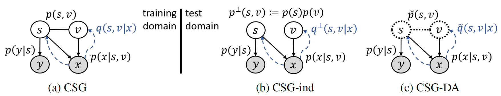

# Learning Causal Semantic Representation for Out-of-Distribution Prediction

This repository is the official implementation of "[Learning Causal Semantic Representation for Out-of-Distribution Prediction](https://arxiv.org/abs/2011.01681)" (NeurIPS 2021).

[Chang Liu][changliu] \<<changliu@microsoft.com>\>,
Xinwei Sun, Jindong Wang, Haoyue Tang, Tao Li, Tao Qin, Wei Chen, Tie-Yan Liu.\
\[[Paper & Appendix](https://changliu00.github.io/causupv/causupv.pdf)\]
\[[Slides](https://changliu00.github.io/causupv/causupv-slides.pdf)\]
\[[Video](https://recorder-v3.slideslive.com/?share=52713&s=7a03cf16-4993-4e27-8502-7461239c487d)\]
\[[Poster](https://changliu00.github.io/causupv/causupv-poster.pdf)\]

Please check [this link](https://github.com/changliu00/causal-semantic-generative-model) for further updates.

## Introduction



The work proposes a Causal Semantic Generative model (CSG) for OOD generalization (_single-source_ domain generalization) and domain adaptation.
The model is developed following a causal reasoning process, and prediction is made by leveraging the _causal invariance principle_.
Training and prediction algorithms are developed based on variational Bayes with a novel design.
Theoretical guarantees on the identifiability of the causal factor and the benefits for OOD prediction are presented.

This codebase implements the CSG methods, and implements or integrates various baselines.

## Requirements

The code requires python version >= 3.6, and is based on [PyTorch](https://github.com/pytorch/pytorch). To install requirements:

```setup
pip install -r requirements.txt
```

## Usage

Folder `a-mnist` contains scripts to run the experiments on the **Shifted-MNIST** dataset,
and `a-imageclef` on the [**ImageCLEF-DA**](http://imageclef.org/2014/adaptation) dataset,
and `a-domainbed` on the [**PACS**](https://openaccess.thecvf.com/content_ICCV_2017/papers/Li_Deeper_Broader_and_ICCV_2017_paper.pdf) and [**VLCS**](https://openaccess.thecvf.com/content_iccv_2013/papers/Fang_Unbiased_Metric_Learning_2013_ICCV_paper.pdf) datasets
(the prefix `a-` represents "application").

Go to the respective folder and run the `prepare_data.sh` or `makedata.sh` script there to prepare the datasets.
Run the `run_ood.sh` (for OOD generalization methods) and `run_da.sh` (for domain adaptation methods) scripts to train the models.
Evaluation result (accuracy on the test domain) is printed and written to disk with the model and configurations.
See the commands in the script files or `python3 main.py --help` for customized usage or hyperparameter tuning.

[changliu]: http://ml.cs.tsinghua.edu.cn/~changliu/index.html

