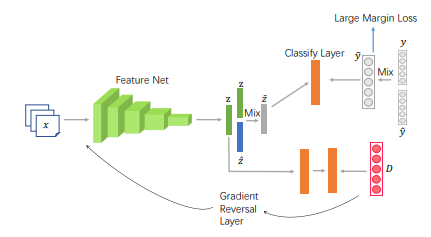

# FIXED: Frustratingly Easy Domain Generalization with Mixup

This project implements our paper [FIXED: Frustratingly Easy Domain Generalization with Mixup](https://arxiv.org/abs/2211.05228). Please refer to our paper [1] for the method and technical details. 



**Abstract:** Domain generalization (DG) aims to learn a generalizable model from multiple training domains such that it can perform well on unseen target domains. A popular strategy is to augment training data to benefit generalization through methods such as Mixup [1]. While the vanilla Mixup can be directly applied, theoretical and empirical investigations uncover several shortcomings that limit its performance. Firstly, Mixup cannot effectively identify the domain and class information that can be used for learning invariant representations. Secondly, Mixup may introduce synthetic noisy data points via random interpolation, which lowers its discrimination capability. Based on the analysis, we propose a simple yet effective enhancement for Mixup-based DG, namely domain-invariant Feature mIXup (FIX). It learns domain-invariant representations for Mixup. To further enhance discrimination, we leverage existing techniques to enlarge margins among classes to further propose the domain-invariant Feature MIXup with Enhanced Discrimination (FIXED) approach. We present theoretical insights about guarantees on its effectiveness. Extensive experiments on seven public datasets across two modalities including image classification (Digits-DG, PACS, Office-Home) and time series (DSADS, PAMAP2, UCI-HAR, and USC-HAD) demonstrate that our approach significantly outperforms nine state-of-the-art related methods, beating the best performing baseline by 6.5% on average in terms of test accuracy.


## Requirement

The required packages are listed in `requirements.txt` for minimum requirement (Python 3.8.5):

```
$ pip install -r requirements.txt
$ pip install torch==1.10.1+cu111 torchvision==0.11.2+cu111 torchaudio==0.10.1 -f https://download.pytorch.org/whl/cu111/torch_stable.html
```

## Dataset 
USC-SIPI human activity dataset (USC-HAD) is composed of 14 subjects (7 male, 7 female, aged from 21 to 49) executing 12 activities with a sensor tied on the front right hip. The data dimension is 6 and the sample rate is 100Hz. 12 activities include Walking Forward, Walking Left, Walking Right, Walking Upstairs, Walking Downstairs, Running Forward, Jumping Up, Sitting, Standing, Sleeping, Elevator Up, and Elevator Down.

```
wget https://wjdcloud.blob.core.windows.net/dataset/lwdata/act/usc/usc/usc_x.npy
wget https://wjdcloud.blob.core.windows.net/dataset/lwdata/act/usc/usc/usc_y.npy
```

## How to run

We provide the commands for four tasks in USC-HAD to reproduce the results.

```
python train.py --N_WORKERS 1 --data_dir ../../data/act/ --task cross_people --test_envs 0 --dataset usc --algorithm Fixed --mixupalpha 0.1 --alpha 0.5 --mixup_ld_margin 10 --top_k 5 --output ./results/0
```

```
python train.py --N_WORKERS 1 --data_dir ../../data/act/ --task cross_people --test_envs 1 --dataset usc --algorithm Fixed --mixupalpha 0.2 --alpha 0.5 --mixup_ld_margin 10000 --top_k 1 --output ./results/1
```

```
python train.py --N_WORKERS 1 --data_dir ../../data/act/ --task cross_people --test_envs 2 --dataset usc --algorithm Fixed --mixupalpha 0.1 --alpha 0.1 --mixup_ld_margin 100 --top_k 5 --output ./results/2
```

```
python train.py --N_WORKERS 1 --data_dir ../../data/act/ --task cross_people --test_envs 3 --dataset usc --algorithm Fixed --mixupalpha 0.2 --alpha 1 --mixup_ld_margin 100 --top_k 5 --output ./results/3
```

## Results

**USC-HAD**

| Source   | 1,2,3    | 0,2,3     | 0,1,3     | 0,1,2     | AVG       |
|----------|----------|-----------|-----------|-----------|-----------|
| Target   | 0        | 1         | 2         | 3         | -         |
| ERM      | 80.98    | 57.75     | 74.03     | 65.86     | 69.66     |
| DANN     | 81.22    | 57.88     | 76.69     | 70.72     | 71.63     |
| CORAL    | 78.82    | 58.93     | 75.02     | 53.72     | 66.62     |
| ANDMask  | 79.88    | 55.32     | 74.47     | 65.04     | 68.68     |
| GroupDRO | 80.12    | 55.51     | 74.69     | 59.97     | 67.57     |
| RSC      | 81.88    | 57.94     | 73.39     | 65.13     | 69.59     |
| Mixup    | 79.98    | 64.14     | 74.32     | 61.28     | 69.93     |
| MIX-ALL  | 78.44    | 59.32     | 72.96     | 63.46     | 68.54     |
| GILE     | 78.00    | 62.00     | 77.00     | 63.00     | 70.00     |
| FIXED    | **85.1** | **69.19** | **80.12** | **75.82** | **77.56** |

## Contact

- luwang@ict.ac.cn
- jindongwang@outlook.com


## References

```
@article{lu2022fixed,
  title={FIXED: Frustratingly Easy Domain Generalization with Mixup},
  author={Lu, Wang and Wang, Jindong and Yu, Han and Huang, Lei and Zhang, Xiang and Chen, Yiqiang and Xie, Xing},
  journal={arXiv preprint arXiv:2211.05228},
  year={2022}
}
```
